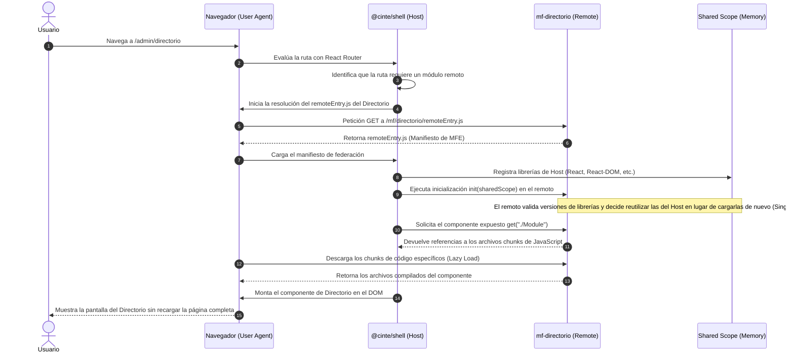

# Guía Completa y Referencia de la Migración a Microfrontends (MFE) — Novedades CINTE

**Ticket de referencia:** AUT-477  
**Rama de trabajo:** `AUT-477-Monorepo-MFE`  
**Audiencia:** Desarrolladores, DevOps, QA, Soporte y Producto.

---

## 1. Resumen Ejecutivo (Explicado sin jerga técnica)

Antes de esta migración, todo el portal web de Novedades CINTE (pantallas de inicio de sesión, administración, cotizador comercial, monitores de contratación y onboarding) estaba construido como una única aplicación monolítica gigante llamada `react-frontend`. 

Aunque el sistema funcionaba, presentaba limitaciones de escalabilidad: cualquier pequeña modificación en un módulo (por ejemplo, el Cotizador) obligaba a desplegar la aplicación completa y conllevaba el riesgo latente de romper otra sección del portal de manera inesperada. Además, los usuarios tenían que descargar todo el código en sus navegadores de golpe, ralentizando la velocidad de carga.

### La Solución: La Analogía del Edificio Lego (Microfrontends)
Hemos dividido la interfaz de usuario en **8 bloques independientes** que se acoplan en tiempo de ejecución. Para el usuario final el portal sigue funcionando como una sola página web unificada en el navegador, con las mismas URLs (`/admin`, `/admin/novedades`, etc.) y el mismo inicio de sesión, pero por detrás está estructurado como un conjunto de piezas acoplables:

| Pieza | Rol en el Edificio | Carpeta |
|-------|--------------------|---------|
| **El Anfitrión (Shell)** | La recepción y los pasillos principales del edificio. Recibe al usuario, valida su sesión/roles y decide qué módulo cargar. | `apps/shell` |
| **Los Invitados (Remotes)** | Las oficinas individuales. Módulos de negocio específicos que se descargan únicamente cuando el usuario navega a ellos. | `apps/mf-*` |
| **Librerías Compartidas** | El manual de marca, reglamentos comunes y mobiliario estándar. Estilos visuales CINTE, control de accesos y llamadas a la API. | `packages/*` |

### Lo que NO Cambió en esta Migración:
* El **backend** (Node.js, APIs de Express, conexión a base de datos PostgreSQL, flujos en AWS S3, DynamoDB y Lambda).
* La **autenticación** (AWS Cognito para administradores y Microsoft Entra ID para consultores).
* La **identidad visual corporativa de CINTE** (colores institucionales, tipografías y soporte de modo claro/oscuro).

---

## 2. Arquitectura y Estructura del Monorepo

El repositorio está organizado como un **Monorepo** gestionado mediante `npm workspaces` y compilado de forma paralela usando `Turborepo`.

```
novedades-cinte/
├── apps/               # Aplicaciones Web (Módulos MFE)
│   ├── shell/          # Anfitrión principal (Puerto: 5175)
│   ├── mf-radicacion/  # Formulario público de novedades (Puerto: 5176)
│   ├── mf-portal-consultor/# Portal de consultores Entra (Puerto: 5177)
│   ├── mf-admin-novedades/# Dashboard de radicación admin (Puerto: 5178)
│   ├── mf-admin-conciliaciones/# Módulo de conciliación mensual (Puerto: 5179)
│   ├── mf-admin-comercial/# Cotizador comercial (Puerto: 5180)
│   ├── mf-admin-capital-humano/# Contratación + Onboarding (Puerto: 5181)
│   └── mf-admin-directorio/# Directorio y catálogos TI (Puerto: 5182)
└── packages/           # Librerías compartidas del Monorepo
    ├── shared/         # Reglas de negocio comunes y access control
    ├── ui-shell/       # Componentes comunes de UI, sidebar y el tema CINTE
    ├── api-client/     # Cliente HTTP unificado para la API
    └── vite-config/    # Helper de empaquetado y federación con Vite
```

### Rutas en Producción (Proxy Inverso)
En producción, para evitar problemas de dominios cruzados (CORS), todos los microfrontends se sirven bajo el mismo dominio del Anfitrión usando rutas relativas gestionadas a través del servidor proxy inverso (como Caddy o Nginx).

---

## 3. ¿Cómo funciona la Federación de Microfrontends (MFE)?

La arquitectura MFE en Novedades CINTE funciona gracias a **Vite Module Federation**. Esta tecnología permite que aplicaciones web compiladas de forma separada puedan compartir código, componentes y páginas en tiempo de ejecución de manera totalmente dinámica.

Para entenderlo de manera sencilla, Module Federation rompe con la idea tradicional de que *"para usar un componente de otra aplicación, este debe estar compilado dentro del mismo paquete"*. En su lugar, el navegador del usuario final se convierte en la plataforma de integración en tiempo real.

### 3.1. Conceptos Fundamentales
* **El Anfitrión (Host / `@cinte/shell`):** Es la aplicación que arranca primero. Carga la estructura básica de la página (el sidebar, cabecera global y tema CINTE) y el sistema de autenticación. Actúa como el orquestador principal.
* **Los Invitados (Remotes / `mf-*`):** Son aplicaciones totalmente autónomas. Tienen sus propios puertos de desarrollo, se compilan de forma independiente y exponen componentes específicos.
* **El Manifiesto (`remoteEntry.js`):** Es el archivo más importante de cada remoto. Es un script de JavaScript ultra-ligero que se genera al compilar. Funciona como la "carta de presentación" o directorio de ese microfrontend: le indica al Anfitrión qué componentes expone públicamente, qué partes de código necesita descargar y qué librerías comparte.
* **Exposición (`exposes`):** Cada remoto decide explícitamente qué componentes comparte. En la configuración de Vite, declaramos rutas simbólicas (por ejemplo: `exposes: { './Module': './src/Module.jsx' }`). El Anfitrión luego lo carga dinámicamente como `import('nombreRemoto/Module')`.
* **Ámbito Compartido (Shared Scope):** Es una base de datos global en la memoria del navegador administrada por Module Federation. Registra las librerías comunes (como React) que todos los módulos aceptan compartir para no descargarlas múltiples veces.

### 3.2. El Flujo de Carga en Tiempo de Ejecución
A continuación se ilustra cómo interactúan el Anfitrión y el Remoto cuando un usuario hace clic en una pestaña del menú lateral:



### 3.3. Mecanismo de Dependencias Compartidas (Shared & Singletons)
En una aplicación de microfrontends tradicional sin Module Federation, si tienes 7 u 8 aplicaciones web corriendo juntas, cargarías 8 copias de React y 8 copias de React-DOM en memoria. Esto no solo ralentiza la red, sino que rompe a React debido a conflictos de estados y Hooks duplicados.

Module Federation soluciona esto a través de la propiedad `shared` con la bandera `singleton: true` en la configuración común de Vite ([createViteConfig.js](file:///c:/Projects/novedades-cinte/packages/vite-config/createViteConfig.js)):
1. **Registro**: Cuando la aplicación principal (Host) arranca, coloca sus instancias de `react`, `react-dom` y `@cinte/ui-shell` en la bodega común (`shared scope`).
2. **Validación**: Al arrancar un módulo remoto, en lugar de importar React de sus propias carpetas, Module Federation intercepta la petición.
3. **Decisión**: Determina que el Host ya proveyó una instancia compatible y desvía la importación del remoto para usar la misma referencia física en memoria que ya está cargada.
4. **Propagación del Tema Corporativo**: `@cinte/ui-shell` se declaró como singleton. Esto garantiza que el cambio del tema claro/oscuro se propague a través de los contextos de React instantáneamente desde el Host hacia todos los Remotos, asegurando coherencia visual completa en el portal.

### 3.4. Tolerancia a Fallos (Error Boundaries)
Si uno de los servidores de un microfrontend se cae (por ejemplo, el módulo de Conciliaciones entra en mantenimiento y responde con error de red), la aplicación completa no deja de funcionar.
En `@cinte/ui-shell` implementamos un `RemoteErrorBoundary` que envuelve las importaciones dinámicas. Si la carga del chunk de red del remoto falla, el boundary intercepta la excepción, detiene la caída general y muestra un mensaje amigable: *"El módulo no está disponible temporalmente"*. El usuario puede seguir utilizando el Anfitrión, el Cotizador, el Directorio y todas las demás pantallas del sistema con total normalidad.

---

## 4. El Proceso de Migración Paso a Paso

### Fase 1: Preparación del Entorno
Configuramos la raíz del proyecto como un monorepo unificado. Desarrollamos un helper de compilación común llamado `@cinte/vite-config` para encapsular las reglas de **Vite Module Federation**. Esto permitió que cada módulo pudiera compilarse por separado pero compartir dependencias críticas como `react` y `react-dom` como instancias únicas (**singletons**), previniendo que se cargaran múltiples copias de React en el navegador.

### Fase 2: Extracción y Modularización
Módulo por módulo, extrajimos el código del antiguo `react-frontend` y lo reubicamos en sus respectivas carpetas dentro de `apps/`. En este proceso, reemplazamos las llamadas de archivos internos por las importaciones a los paquetes locales compartidos (`@cinte/shared`, `@cinte/ui-shell` y `@cinte/api-client`), lo que redujo drásticamente el acoplamiento y la duplicación de código.

### Fase 3: Centralización de Estilos Corporativos (Tema CINTE)
Consolidamos la guía visual y variables del proyecto en `@cinte/ui-shell`.
* Creamos archivos específicos para desacoplar el diseño: `cinte-fonts.css` (fuentes locales Exo y Montserrat), `cinte-tailwind-theme.css` (tokens de colores corporativos de CINTE) y `cinte-global.css` (clases de diseño como `.surface-panel` o scrollbars personalizadas).
* Creamos el script `node scripts/mfe-sync-remote-styles.js` para sincronizar y propagar de forma automática y consistente los estilos unificados a todos los microfrontends.

### Fase 4: Optimización de Compresión (Minificación)
Activamos la minificación (`minify: true`) en el empaquetado de producción de todos los microfrontends en `@cinte/vite-config`.
* **Impacto**: El tamaño del bundle principal de Capital Humano se redujo de **1.87 MB** a **724 KB** (y a solo **220 KB** al ser transferido por internet con compresión gzip), lo que se traduce en un **88.2% de ahorro en red** y cargas instantáneas para el usuario final.
* **Tiempos de Compilación**: Al reducir la escritura de archivos en disco, el tiempo de construcción de todo el monorepo bajó de **44.4 a 26.6 segundos**.

### Fase 5: Suite de Pruebas y Aseguramiento de Calidad
Modificamos el script `test` en `package.json` para realizar un auto-descubrimiento dinámico de las pruebas del backend mediante globbing. 
* Esto incorporó automáticamente las pruebas `duplicadoPendienteRule.test.js` y `mallasTurnos.routes.test.js` (antes omitidas) a la suite del servidor.
* Verificamos el comportamiento del frontend federado mediante pruebas con Vitest para componentes compartidos como el `RemoteErrorBoundary` (que maneja caídas graciosas de microfrontends).

---

## 5. Lecciones Aprendidas y Solución de Problemas

Durante el ensamblaje de la arquitectura de microfrontends, identificamos y solucionamos diversos síntomas de integración:

| Síntoma en Desarrollo | Causa Identificada | Solución Aplicada |
|-----------------------|--------------------|-------------------|
| **Pantalla de módulo "en blanco" o error de carga** | El microfrontend remoto no estaba iniciado en su respectivo puerto local. | Asegurar el arranque paralelo de todas las aplicaciones del monorepo mediante el comando raíz `npm run dev`. |
| **Error de proxy en el login (`/api/login` no responde)** | El backend (servidor Node.js en puerto 3005) estaba apagado o el puerto estaba ocupado por otro proceso. | Ejecutar `npm run dev:backend` y verificar que el puerto 3005 esté libre. |
| **El tema claro no se aplicaba a los módulos remotos** | Cada microfrontend gestionaba su propio estado del tema en memoria, aislándose del cambio global del Anfitrión. | Exportamos el contexto de temas de `@cinte/ui-shell` desde su raíz y forzamos la sincronización de la clase `cinte-ui-light` directamente en la etiqueta `<html>` de la página. |
| **Redirección o pantalla vacía al ingresar a Conciliaciones** | Las rutas internas configuradas en el microfrontend de conciliaciones no coincidían con el prefijo asignado en el Anfitrión (`/admin/conciliaciones`). | Se alinearon las rutas del enrutador bajo `/admin/conciliaciones/*` en el shell y se configuró una redirección automática hacia el dashboard interno del módulo. |

---

## 6. Guía de Ejecución y Arranque Local

### Requisitos Previos
1. **Node.js 20+** e instalación de dependencias en la raíz del repositorio (`npm install`).
2. Configurar el archivo `.env` en la raíz (puedes tomar como referencia el archivo [.env.example](file:///c:/Projects/novedades-cinte/.env.example)).

### Ejecución en Desarrollo (Dos terminales)

* **Terminal A — Servidor de API (Backend):**
  ```bash
  npm run dev:backend
  ```
  *Escucha en:* `http://localhost:3005` (o en el puerto definido en la variable `PORT`).

* **Terminal B — Aplicaciones Frontend (MFE):**
  ```bash 
  npm run dev
  ```
  *Escucha en:* `http://localhost:5175` (Shell principal). Este comando inicia en paralelo el cascarón y los 7 módulos de negocio utilizando Turborepo.

### Otros Comandos de Utilidad
* **Construcción de producción:** `npm run build` (compila y optimiza el monorepo completo).
* **Ejecutar todas las pruebas:** `npm run test:all` (ejecuta los 300 tests del backend y la suite de Vitest del frontend).

---

## 7. Despliegue en Producción (Docker + Caddy)

Para facilitar el despliegue del frontend federado en entornos productivos, implementamos una infraestructura contenerizada multi-etapa:

1. **Dockerfile Frontend MFE (`Dockerfile.frontend.mfe`):**
   - **Fase de Construcción (Build):** Instala las dependencias y compila todo el monorepo (`npm run build`).
   - **Fase de Servidor:** Utiliza una imagen ligera de **Caddy** y copia los recursos estáticos. El Shell se coloca en la raíz del servidor (`/`), mientras que los remotos compilados se montan bajo sus subcarpetas correspondientes (`/mf/<modulo>`).
2. **Caddyfile Frontend (`Caddyfile.frontend`):**
   - Configura el enrutamiento para responder con el `index.html` del Shell ante cualquier ruta de navegación, permitiendo que React Router maneje las vistas de forma interna, y sirve correctamente los archivos JavaScript de federación con codificación UTF-8.
