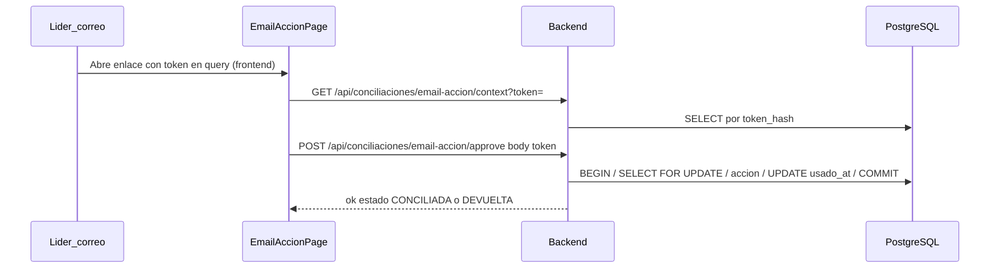

# Enlaces email-acción — Aprobar / rechazar conciliación por correo

Documentación del flujo **magic link** que permite al líder externo aprobar o rechazar una conciliación desde el correo enviado por el analista, sin iniciar sesión en el portal.

**Audiencia:** desarrolladores, DevOps, QA técnico.

---

## Resumen funcional

1. El analista envía el correo **Conciliación al líder** desde el módulo Conciliaciones (servicio en estado **Enviada**).
2. El backend genera dos tokens opacos (approve / reject), los persiste hasheados en PostgreSQL y los incluye como URLs en el payload de la Lambda `email-transactions`.
3. El líder abre el enlace del correo → landing pública del frontend (`/conciliaciones/email-accion?token=…&accion=…`).
4. La landing consulta contexto al API, muestra datos del servicio y permite confirmar aprobación o rechazo (con observación obligatoria en reject).
5. Tras ejecutar la acción, el token queda **consumido** (`usado_at`) y no puede reutilizarse.

---

## Flujo técnico



Diagrama fuente: [`diagrams/07-email-accion-seguridad.mmd`](./diagrams/07-email-accion-seguridad.mmd).

---

## Contrato API (backend)

Rutas **públicas** (sin sesión). El token **no** va en el path para evitar filtración en logs HTTP (`logs/http-audit.jsonl`).

| Método | Ruta | Token | Descripción |
|--------|------|-------|-------------|
| `GET` | `/api/conciliaciones/email-accion/context` | Query `?token=` | Contexto: servicio, periodo, acción esperada |
| `POST` | `/api/conciliaciones/email-accion/approve` | Body `{ "token": "…" }` | Marca servicio **CONCILIADA** |
| `POST` | `/api/conciliaciones/email-accion/reject` | Body `{ "token": "…", "observacion": "…" }` | Devuelve servicio al analista |

### Respuestas de error habituales

| HTTP | Situación |
|------|-----------|
| `400` | Token ausente, acción incorrecta, observación vacía en reject |
| `404` | Token no encontrado |
| `409` | Condición de carrera: otro request consumió el token en la misma ventana |
| `410` | Enlace ya utilizado o expirado |
| `429` | Rate limit por IP superado |

### CSRF

Las rutas bajo `/api/conciliaciones/email-accion/` **excluyen validación CSRF** en `server.js`: el líder externo no tiene cookie de sesión. La seguridad recae en el token opaco de un solo uso, TTL corto y rate limit.

Si el navegador del líder **sí** tiene cookie CSRF (p. ej. abrió el portal en otra pestaña), el frontend envía el header opcionalmente; no es requisito.

---

## URLs del correo (frontend)

Generadas en `conciliacionEmailAccion.js` → `buildActionUrl`:

```text
{PORTAL_BASE_URL}/conciliaciones/email-accion?token={hex64}&accion=approve
{PORTAL_BASE_URL}/conciliaciones/email-accion?token={hex64}&accion=reject
```

- `PORTAL_BASE_URL` / `VITE_*` según entorno (local, QA, prod).
- El token en la URL del **frontend** es esperado; solo el backend evita token en path de API.

---

## Medidas de seguridad

| Medida | Implementación |
|--------|----------------|
| **TTL corto** | Default **72 h** (`CONCILIACION_EMAIL_TOKEN_TTL_HOURS`). Tokens ya emitidos conservan su `expira_at` en BD. |
| **Hash en BD** | Solo se guarda `SHA-256` del token; el valor en claro viaja solo en el correo y en tránsito cliente↔API. |
| **Consumo atómico** | `executeEmailActionTransactional`: `BEGIN` → `SELECT … FOR UPDATE` → acción de negocio → `UPDATE usado_at WHERE usado_at IS NULL` → `COMMIT`. |
| **Rate limit** | `emailAccionLimiter` en `server.js`: default **40 req / 15 min / IP** en las 3 rutas. |
| **Sin token en path API** | Evita hex de 64 chars en `req.path` y auditoría HTTP. |
| **Redacción en logs** | `sanitizeAuditPath` / `sanitizeAuditUrl` en `runtimeAudit.js` enmascaran segmentos hex y `token=` en query. |
| **Referrer** | Landing con `<meta name="referrer" content="no-referrer">` para no filtrar token a terceros vía header Referer. |

---

## Variables de entorno

Definidas en `.env.example` (sección Conciliaciones):

```env
# Enlace aprobar/rechazar conciliación por correo al líder (magic link). Default: 72 h.
CONCILIACION_EMAIL_TOKEN_TTL_HOURS=72

# Rate limit rutas públicas email-acción (por IP). Default: 40 req / 15 min.
# CONCILIACION_EMAIL_RATE_LIMIT_WINDOW_MIN=15
# CONCILIACION_EMAIL_RATE_LIMIT_MAX=40
```

Prioridad TTL: `CONCILIACION_EMAIL_TOKEN_TTL_HOURS` → `CONCILIACION_EMAIL_TOKEN_TTL_DAYS` (legacy) → 72 h.

---

## Base de datos

Tabla: `conciliaciones_email_acciones`

| Columna | Uso |
|---------|-----|
| `token_hash` | SHA-256 del token en claro |
| `servicio_id`, `anio`, `mes` | Contexto del cierre |
| `accion` | `approve` \| `reject` |
| `recipient_email` | Destinatario del correo |
| `event_id` | Correlación con envío Lambda |
| `expira_at` | Caducidad del enlace |
| `usado_at` | Consumo (NULL = pendiente) |
| `observacion` | Observación en reject |

La tabla se crea en arranque vía `ensureConciliacionesEmailAccionesTable` en `src/startup.js`.

---

## Archivos relevantes

| Archivo | Rol |
|---------|-----|
| `src/conciliaciones/conciliacionEmailAccion.js` | Tokens, TTL, transacción atómica, URLs |
| `src/conciliaciones/registerConciliacionesRoutes.js` | Rutas HTTP email-acción |
| `react-frontend/src/conciliaciones/ConciliacionesEmailAccionPage.jsx` | Landing pública |
| `server.js` | CSRF skip, `emailAccionLimiter` |
| `src/runtimeAudit.js` | Redacción de paths en auditoría |
| `lambda/email-transactions/` | Plantilla y envío del correo (`conciliacion_correo_lider`) |
| `tests/conciliacionEmailAccion.test.js` | Tests unitarios (TTL, 409, sanitize) |

---

## Verificación manual (QA / dev)

1. Enviar correo de conciliación a un servicio **Enviada**.
2. Abrir enlace **Aprobar** → validar contexto → confirmar → estado **Conciliada**.
3. Reabrir el mismo enlace → mensaje *Enlace ya utilizado* (410/409).
4. Revisar `logs/http-audit.jsonl`: paths como `/api/conciliaciones/email-accion/context` o `/approve`, **sin** hex de 64 caracteres.

---

## Tests

```bash
node --test tests/conciliacionEmailAccion.test.js
```

Cubre: TTL 72 h, prioridad de env, consumo atómico (409), redacción de auditoría, validación de filas de token.

---

*Actualizado: Julio 2026 · Módulo Conciliaciones — Novedades CINTE*
